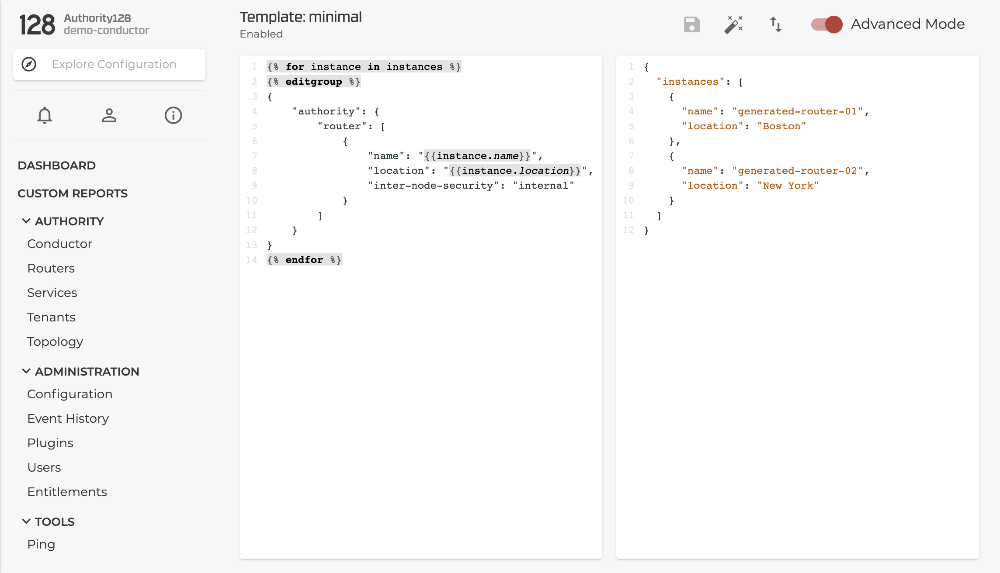

# t128-upload-template

This script provides uploading and rendering a template from local device to a 128T conductor.

## Requirements

In order to run this script you need:

* a 128T conductor of release 4.5 or higher
* an installation of Python 3 and the requests as well as the PyYAML package.

## Installation

After cloning the repo, it is recommended to create a python virtualenv and use `pip` to install the additional packages.

```
git clone https://github.com/128technology/template-utils.git
cd template-utils/t128-upload-template
python3 -m venv venv
venv/bin/pip install -r requirements.txt
```

## Usage

```
venv/bin/python3 t128-upload-template.py -h
usage: t128-upload-template.py [-h] --conductor CONDUCTOR
                               [--username USERNAME] [--password PASSWORD]
                               --template TEMPLATE --data DATA [--commit]
                               [--revert] [--restore RESTORE] [--insecure]
                               [--force]

Upload and render 128T configuration templates

optional arguments:
  -h, --help            show this help message and exit
  --conductor CONDUCTOR, -c CONDUCTOR
                        conductor host
  --username USERNAME, -u USERNAME
                        conductor username (default: admin)
  --password PASSWORD, -p PASSWORD
                        conductor password
  --template TEMPLATE, -t TEMPLATE
                        template file
  --data DATA, -d DATA  data file
  --validate            validate configuration changes
  --commit              commit configuration changes
  --revert, -r          revert config to running before apply template
  --restore RESTORE     restore backup config prior to apply the template
  --insecure            skip TLS certificate validation
  --force, -f           force template upload
```

## Upload a template

The following example shows how to upload a minimal template together with its variables.
`conductor` needs to be replaced by your conductor FQDN or IP address.

```
venv/bin/python3 t128-upload-template.py -c conductor -t minimal.yaml -d minimal-variables.yaml
```

Please ensure the conductor certificate is valid or use `--insecure` to override certificate validation.

The uploaded template and instances can be inspected as any other template on the conductor:




For subsequent uploads the script refuses to overwrite an existing template:

```
ERROR: Template already exists on the conductor Use --force to override.
```

As the error message indicates this can overridden by `--force` or `-f`

At this point the new config has not yet been committed. This allows you to upload and apply more templates (e.g one for datacenter and one for all the branches).

Finally, a commit can be triggered by the ui/pcli or the `--commit` parameter with the last template upload run.

## Writing templates

The yaml syntax allows an easy transformation from text based 128T config into a template.

For example this configuration:

```
config

    authority

        router  generated-router-01
            name                 generated-router-01
            location             Boston
            inter-node-security  internal
        exit

        router  generated-router-02
            name                 generated-router-02
            location             "New York"
            inter-node-security  internal
        exit
    exit
exit
```

translates into (`minimal.yaml`):

```
authority:
  router:
  - name: "{{instance.name}}"
    location: "{{instance.location}}"
    inter-node-security: internal
```

and the data file (`minimal-variables.yaml`):

```
instances:
- name: generated-router-01
  location: Boston
- name: generated-router-02
  location: New York
```

The variables between `{{ ... }}` are replaced by the variables provided by the instances/data file.